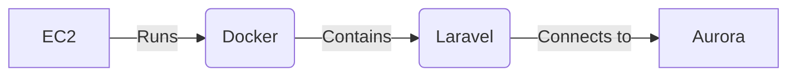
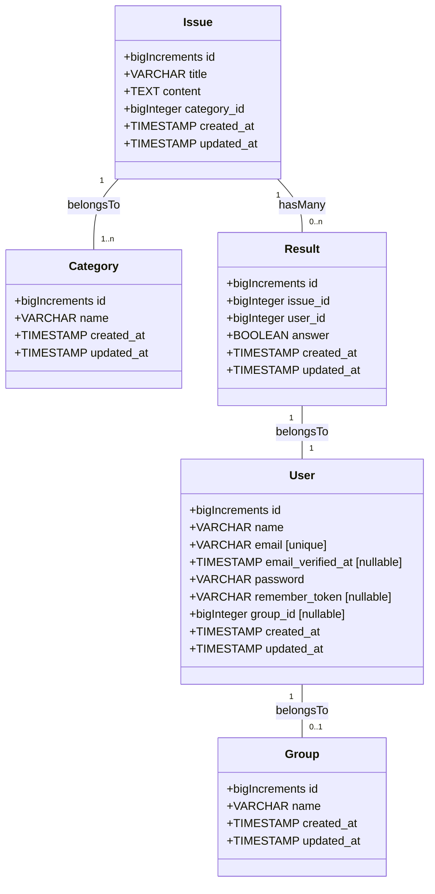

# tenno-hai-front

## Introduction
<!-- 概要 -->
天皇杯をサポートするためのユーザー登録や、問題表示、ランキング表示、インストール方法などのWebサービスを提供します。アプリケーションはLaravel All in Oneで作成されていますが、WebAPIも利用できるようになります。

## Usage
<!-- 使い方 -->
<https://tennohai.qqey.net> から利用出来ます。

<!-- TODO -->

## Purpose
<!-- 課題目的 -->

大学のサークルであるシス研は、オンプレミス環境にサーバーを置き、現場と変わらない本格的なネットワーク環境を持っています。

しかし、サークル環境は会社と違って人の流動が多く、長期的にメンテナンスが出来ないため、手入れをするのが難しい状態になっています。

プロジェクト天皇杯は、属人化、人手不足という課題を解決するために立案されました。

シス研に限らず、インフラを学びたい方に向けたサービスを提供する予定です。

## Requirement definition
<!-- 要件定義,実装した機能 -->

- 問題文表示機能
  - MarkDown
- 環境構築機能
- チェックサービスの導入
  - Webでユーザごとの採点(LaravelAPI)
  - OTPを使って判定コードを持ってくる
  - ランキング形式で表示
- 会員登録機能(GitHubAuth?)
  - グループ機能

## Feature

- 時限式の問題表示..

## Enbironment



| Tool           | Version  |
| -------------- | -------- |
| Composer       | 2.2.6    |
| Node.js        | 16.15.0  |
| PHP            | 8.1.2    |
| Docker Compose | 2.4.1    |
| Docker         | 20.10.14 |

## Development
<!-- 開発着手方法 -->
### Laravel

事前にComposer,Docker,DockerComposeの導入が必要です。

Laravel Sailでの環境構築を想定してますが、状況に応じてご自身でDB環境など用意して貰っても構いません。

```shell
# Laravel install
cd ./laravel
composer install
cp .env.sample .env
./vendor/bin/sail up -d
./vendor/bin/sail php artisan key:generate
./vendor/bin/sail php artisan migrate

# View install
./vendor/bin/sail npm install
./vendor/bin/sail npm run dev
```

Access: <http://localhost/>

### CDK

laravelのデプロイにはCDKを利用する(予定)。

```shell
# cdk install
npm install -g aws-cdk

# aws cli install
brew install awscli

# aws configure
aws configure

# cdk deploy
cd ./cdk
npm install
npm run build
cdk deploy
```

<https://aws.amazon.com/jp/cdk/>

## Database
<!-- データベース構成 -->
データベース構成は以下の通りです。



## Web
<!-- Webアプリケーション構成 -->
Webアプリケーション構成は以下の通りです。

```php
  /index --> GET;

  /login --> GET;
  /login --> POST;

  /register --> GET;
  /register --> POST;

  /logout --> POST;

  /issues --> GET;
  /issues --> POST;
  /issues/:id --> GET;
  /issues/:id --> POST;
  /issues/:id/edit --> GET;
  /issues/:id/edit --> POST;
  /issues/:id/delete --> POST;

  /categories --> GET;
  /categories --> POST;
  /categories/:id --> GET;
  /categories/:id --> POST;
  /categories/:id/edit --> GET;
  /categories/:id/edit --> POST;
  /categories/:id/delete --> POST;

  /groups --> GET;
  /groups --> POST;
  /groups/:id --> GET;
  /groups/:id --> POST;
  /groups/:id/edit --> GET;
  /groups/:id/edit --> POST;
  /groups/:id/delete --> POST;

  /users --> GET;
  /users --> POST;
  /users/:id --> GET;
  /users/:id --> POST;
  /users/:id/edit --> GET;
  /users/:id/edit --> POST;
  /users/:id/delete --> POST;

  /issues/:id/result --> GET;
  /issues/:id/result --> POST;
  /issues/:id/result/:id --> GET;
  /issues/:id/result/:id --> POST;
  /issues/:id/result/:id/edit --> GET;
  /issues/:id/result/:id/edit --> POST;
  /issues/:id/result/:id/delete --> POST;
```
