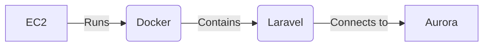
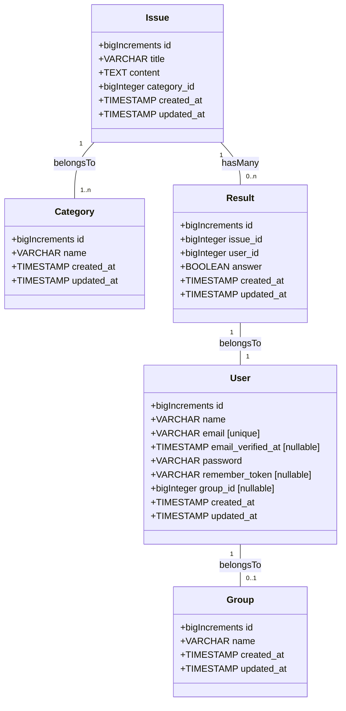

# tenno-hai-front

## Introduction
<!-- 概要 -->
天皇杯をサポートするためのユーザー登録や、問題表示、ランキング表示、インストール方法などのWebサービスを提供します。アプリケーションはLaravel All in Oneで作成されていますが、WebAPIも利用できるようになります。

## Usage
<!-- 使い方 -->
<https://tennohai.qqey.net> から利用出来ます。

<!-- TODO -->

## Purpose
<!-- 課題目的 -->

大学のサークルであるシス研は、オンプレミス環境にサーバーを置き、現場と変わらない本格的なネットワーク環境を持っています。

しかし、サークル環境は会社と違って人の流動が多く、長期的にメンテナンスが出来ないため、手入れをするのが難しい状態になっています。

プロジェクト天皇杯は、属人化、人手不足という課題を解決するために立案されました。

シス研に限らず、インフラを学びたい方に向けたサービスを提供する予定です。

## Requirement definition
<!-- 要件定義 -->

- 問題文表示機能
  - MarkDown
- 環境構築機能
- チェックサービスの導入
  - Webでユーザごとの採点(LaravelAPI)
  - OTPを使って判定コードを持ってくる
  - ランキング形式で表示
- 会員登録機能(GitHubAuth?)
  - グループ機能

## Feature

### Laravel Web Routes

- 製品紹介ページ
    - /
        - GET
- 会員登録機能(middleware:auth)
  - /login
  - /register
  - /profile
  - /group
- 環境構築機能
    - /tutorial/
        - GET
        - チュートリアルの一覧
    - /tutorial/{:post_id}
        - GET,PUT,DELETE
        - チュートリアルの内容
            - tutorial/getting-started
            - tutorial/docker基礎
            - tutorial/ubuntu基礎
    - /tutorial/new
        - GET,POST
        - チュートリアルの投稿
- 問題表示機能
    - /tasks/
        - GET
        - タスクの一覧
    - /tasks/{:post_id}
        - GET,PUT,DELETE
        - タスクの内容
            - tasks/nginx
    - /tasks/new
        - GET,POST
        - タスクの追加
- チェックサービスの導入
    - /tasks/{:post_id}/result/
        - GET,POST
        - タスクの完了判定
- ランキング表示
    - /task/{:post_id}/submissions
        - GET
    - /ranking/
        - GET

## Enbironment



| Tool           | Version  |
| -------------- | -------- |
| Composer       | 2.2.6    |
| Node.js        | 16.15.0  |
| PHP            | 8.1.2    |
| Docker Compose | 2.4.1    |
| Docker         | 20.10.14 |

## Development
<!-- 開発着手方法 -->
### Laravel

事前にComposer,Docker,DockerComposeの導入が必要です。

Laravel Sailでの環境構築を想定してますが、状況に応じてご自身でDB環境など用意して貰っても構いません。

```shell
# Laravel install
cd ./laravel
composer install
cp .env.sample .env
./vendor/bin/sail up -d
./vendor/bin/sail php artisan key:generate
./vendor/bin/sail php artisan migrate

# View install
./vendor/bin/sail npm install
./vendor/bin/sail npm run dev
```

Access: <http://localhost/>

### CDK

インフラ構成はCDKを利用する(予定)。

```shell
# cdk install
npm install -g aws-cdk

# aws cli install
brew install awscli

# aws configure
aws configure

# cdk deploy
cd ./cdk
npm install
npm run build
cdk deploy
```

<https://aws.amazon.com/jp/cdk/>

## Database
<!-- データベース構成 -->
データベース構成は以下の通りです。


