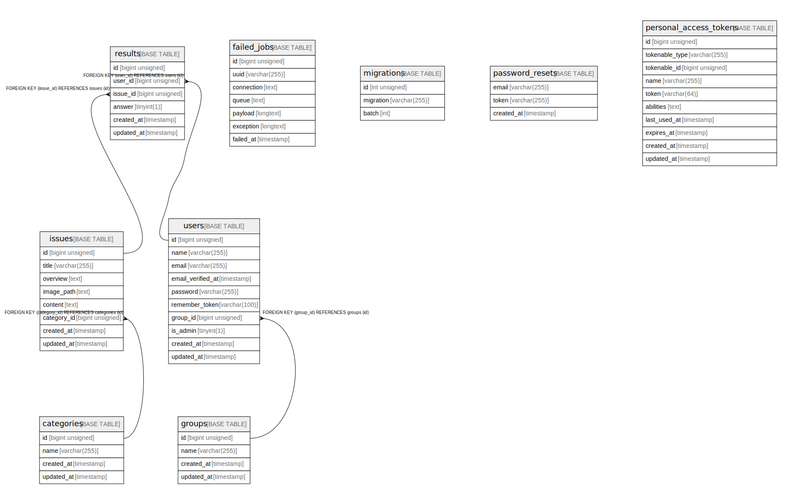

# laravel

## Tables

| Name | Columns | Comment | Type |
| ---- | ------- | ------- | ---- |
| [categories](categories.md) | 4 |  | BASE TABLE |
| [failed_jobs](failed_jobs.md) | 7 |  | BASE TABLE |
| [groups](groups.md) | 4 |  | BASE TABLE |
| [issues](issues.md) | 8 |  | BASE TABLE |
| [migrations](migrations.md) | 3 |  | BASE TABLE |
| [password_resets](password_resets.md) | 3 |  | BASE TABLE |
| [personal_access_tokens](personal_access_tokens.md) | 10 |  | BASE TABLE |
| [results](results.md) | 6 |  | BASE TABLE |
| [users](users.md) | 10 |  | BASE TABLE |

## Relations

---

> Generated by [tbls](https://github.com/k1LoW/tbls)
