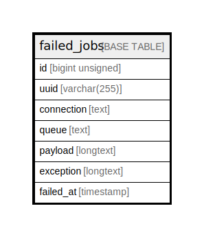

# failed_jobs

## Description

<details>
<summary><strong>Table Definition</strong></summary>

```sql
CREATE TABLE `failed_jobs` (
  `id` bigint unsigned NOT NULL AUTO_INCREMENT,
  `uuid` varchar(255) COLLATE utf8mb4_unicode_ci NOT NULL,
  `connection` text COLLATE utf8mb4_unicode_ci NOT NULL,
  `queue` text COLLATE utf8mb4_unicode_ci NOT NULL,
  `payload` longtext COLLATE utf8mb4_unicode_ci NOT NULL,
  `exception` longtext COLLATE utf8mb4_unicode_ci NOT NULL,
  `failed_at` timestamp NOT NULL DEFAULT CURRENT_TIMESTAMP,
  PRIMARY KEY (`id`),
  UNIQUE KEY `failed_jobs_uuid_unique` (`uuid`)
) ENGINE=InnoDB DEFAULT CHARSET=utf8mb4 COLLATE=utf8mb4_unicode_ci
```

</details>

## Columns

| Name | Type | Default | Nullable | Extra Definition | Children | Parents | Comment |
| ---- | ---- | ------- | -------- | ---------------- | -------- | ------- | ------- |
| id | bigint unsigned |  | false | auto_increment |  |  |  |
| uuid | varchar(255) |  | false |  |  |  |  |
| connection | text |  | false |  |  |  |  |
| queue | text |  | false |  |  |  |  |
| payload | longtext |  | false |  |  |  |  |
| exception | longtext |  | false |  |  |  |  |
| failed_at | timestamp | CURRENT_TIMESTAMP | false | DEFAULT_GENERATED |  |  |  |

## Constraints

| Name | Type | Definition |
| ---- | ---- | ---------- |
| failed_jobs_uuid_unique | UNIQUE | UNIQUE KEY failed_jobs_uuid_unique (uuid) |
| PRIMARY | PRIMARY KEY | PRIMARY KEY (id) |

## Indexes

| Name | Definition |
| ---- | ---------- |
| PRIMARY | PRIMARY KEY (id) USING BTREE |
| failed_jobs_uuid_unique | UNIQUE KEY failed_jobs_uuid_unique (uuid) USING BTREE |

## Relations



---

> Generated by [tbls](https://github.com/k1LoW/tbls)
