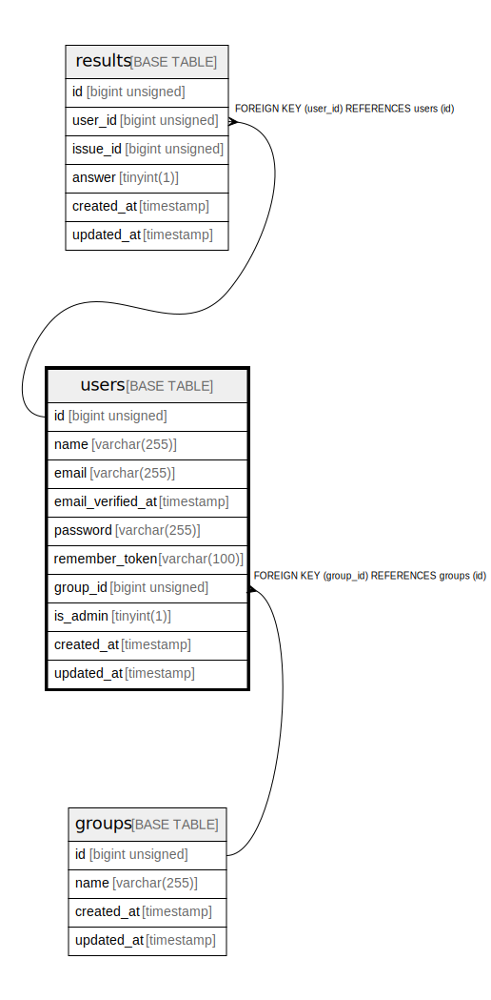

# users

## Description

<details>
<summary><strong>Table Definition</strong></summary>

```sql
CREATE TABLE `users` (
  `id` bigint unsigned NOT NULL AUTO_INCREMENT,
  `name` varchar(255) COLLATE utf8mb4_unicode_ci NOT NULL,
  `email` varchar(255) COLLATE utf8mb4_unicode_ci NOT NULL,
  `email_verified_at` timestamp NULL DEFAULT NULL,
  `password` varchar(255) COLLATE utf8mb4_unicode_ci NOT NULL,
  `remember_token` varchar(100) COLLATE utf8mb4_unicode_ci DEFAULT NULL,
  `group_id` bigint unsigned DEFAULT NULL,
  `is_admin` tinyint(1) NOT NULL DEFAULT '0',
  `created_at` timestamp NULL DEFAULT NULL,
  `updated_at` timestamp NULL DEFAULT NULL,
  PRIMARY KEY (`id`),
  UNIQUE KEY `users_email_unique` (`email`),
  KEY `users_group_id_foreign` (`group_id`),
  CONSTRAINT `users_group_id_foreign` FOREIGN KEY (`group_id`) REFERENCES `groups` (`id`)
) ENGINE=InnoDB DEFAULT CHARSET=utf8mb4 COLLATE=utf8mb4_unicode_ci
```

</details>

## Columns

| Name | Type | Default | Nullable | Extra Definition | Children | Parents | Comment |
| ---- | ---- | ------- | -------- | ---------------- | -------- | ------- | ------- |
| id | bigint unsigned |  | false | auto_increment | [results](results.md) |  |  |
| name | varchar(255) |  | false |  |  |  |  |
| email | varchar(255) |  | false |  |  |  |  |
| email_verified_at | timestamp |  | true |  |  |  |  |
| password | varchar(255) |  | false |  |  |  |  |
| remember_token | varchar(100) |  | true |  |  |  |  |
| group_id | bigint unsigned |  | true |  |  | [groups](groups.md) |  |
| is_admin | tinyint(1) | 0 | false |  |  |  |  |
| created_at | timestamp |  | true |  |  |  |  |
| updated_at | timestamp |  | true |  |  |  |  |

## Constraints

| Name | Type | Definition |
| ---- | ---- | ---------- |
| PRIMARY | PRIMARY KEY | PRIMARY KEY (id) |
| users_email_unique | UNIQUE | UNIQUE KEY users_email_unique (email) |
| users_group_id_foreign | FOREIGN KEY | FOREIGN KEY (group_id) REFERENCES groups (id) |

## Indexes

| Name | Definition |
| ---- | ---------- |
| users_group_id_foreign | KEY users_group_id_foreign (group_id) USING BTREE |
| PRIMARY | PRIMARY KEY (id) USING BTREE |
| users_email_unique | UNIQUE KEY users_email_unique (email) USING BTREE |

## Relations



---

> Generated by [tbls](https://github.com/k1LoW/tbls)
