# インフラを学びたい人向け学習サービスの作成

**1 .はじめに**

本レポートでは、最終課題にて作成した、インフラを学びたい人向けの学習サービスである天皇杯（以下「天皇杯フロント」という。）の説明を述べる。サービスの設計と仕様、設計のコンセプトを述べるとともに、反省点などの振り返りも行う。

**2. 設計**

　この章では、天皇杯フロントのコンセプトと技術構成、設計について述べる。

**2.1 コンセプト**

　天皇杯のコンセプトは、はじめにも説明した、インフラを学びたい人向けの学習を支援するサービスである。昨今はプログラミング学習を支援するサービスが台頭する中、インフラ学習を支援するサービスが無く、初学者が入門しにくい問題点がある。そこで、インフラ構築に関係する知識について手を動かして学ぶことで、実践的なスキルを身に付けるWebサービスを開発した。

天皇杯フロントは、天皇杯を利用したいユーザをサポートするための環境構築方法や問題の表示、ランキング表示を行うWebアプリであり、これを利用することによって、インフラを学習しやすい環境を提供することである。

**2.2 仕様**

　天皇杯フロントは、大まかに、ユーザ登録と削除、クリア数を確認できるダッシュボード、チュートリアル、問題機能、ランキング機能がある。ユーザはまず会員登録を行った後、チュートリアル画面にて環境構築を行う。そののちに、問題画面にて学びたいインフラの問題を解き、解いたら完了を押すという流れになっている。完了すると、その問題が問題画面から消えて、やっていない問題のみ表示する流れとなっている。

　また、ランキング表示は、ユーザの問題クリア数に応じて順位づけられる。一番多く問題を解いた人が上位に表示される仕組みとなっている。

**2.3 技術構成**

　天皇杯フロントは、Laravelと呼ばれるPHPのフルスタックフレームワークを基に作成した。下記の図1に利用した環境を記す。

| PHP(^8)     | プログラミング言語     |
|-------------|------------------------|
| composer    | パッケージ管理システム |
| Laravel(^9) | Webフレームワーク      |
| Docker      | コンテナ環境           |

図1:利用した主な技術環境

今回の制作では、Laravelの標準機能に備わっているLaravel Sail、Laravel Breezeと呼ばれるコンテナ環境と会員登録機能開発をサポートするモジュールを導入している。また、bladeと呼ばれるPHPのテンプレートエンジン、TailwindCSS(flowbite)と呼ばれるCSSフレームワーク、Eloquentと呼ばれるDBのORM、tblsと呼ばれるテーブルスキーマをmarkdownに出力するソフトウェアを利用している。

CSSのコンポーネントは<https://tailblocks.cc/>とhttps://www.hyperui.dev/を利用して制作した。

**2.4 画面設計**

　画面設計では、2.2章で説明した仕様の流れを画面に起こしている。図2にその遷移を示す。

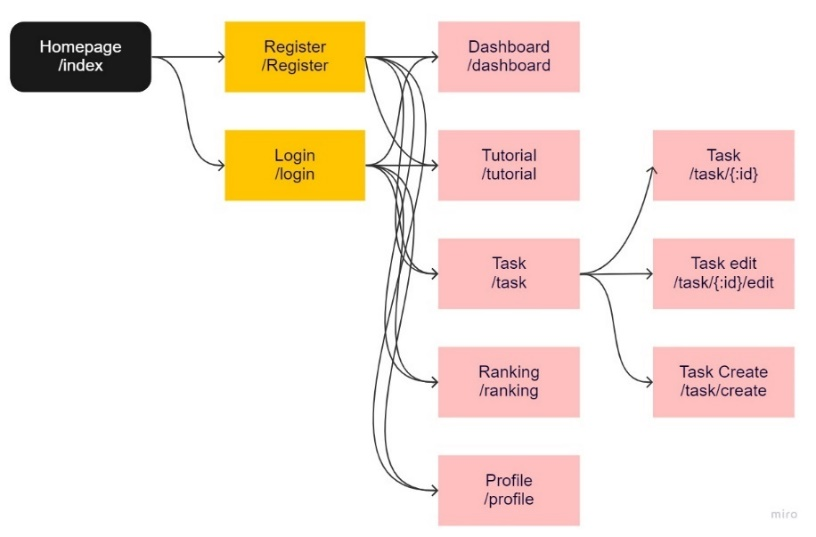

図2:画面の全体的なフローチャート

　ページにアクセスすると、図3のようなページが表示される。初めての天皇杯フロントを利用する方々にどういうものであるかの概要を載せている。右上にログインと会員登録ボタンがある他、Get Startedボタンからでも遷移することが出来る。

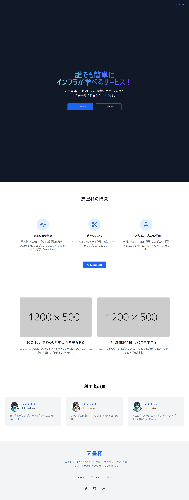

図3: ホームページ画面

　Registerを押すと図4のようなページに飛ぶ。ここから会員登録を行う。ログインは図5の様に表示される。なお、この機能はLaravel Breezeを利用して開発した。

図4: 会員登録を行う画面

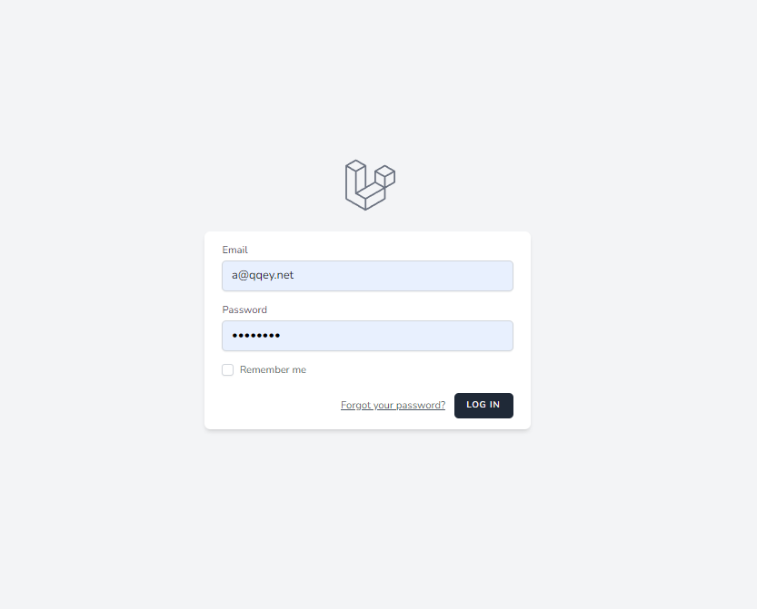

図5: ログイン画面

　

ログインすると、ダッシュボード画面が図6の様に表示される。ここで、ユーザがどのぐらいタスクを終わらせているのかを確認できることから、どの様に進めればいいかの案内を示している。

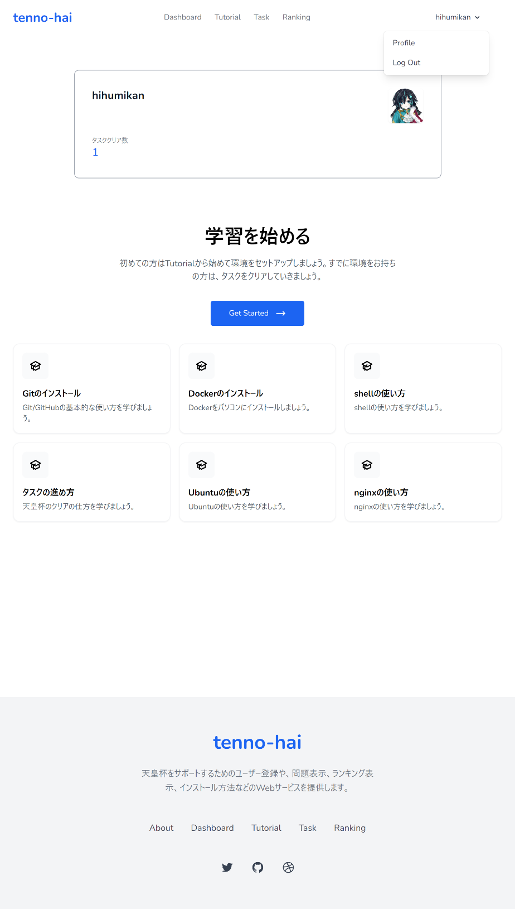

図6:ダッシュボード画面

チュートリアル画面では図7の様に表示される。天皇杯に触れる初めての方に向けた最初の環境構築を出来るような指示を書いている。番号順にクリックすることで、天皇杯を始めれるようなリンクに飛ぶことが出来る。

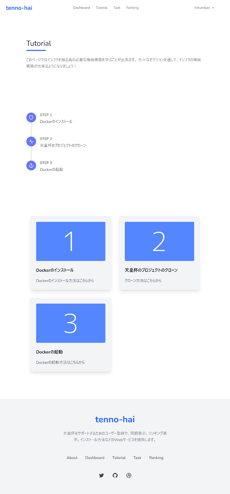

図7:チュートリアル画面

　図8では、本命の機能である、問題表示機能を示している。ここでは、問題の一覧をカテゴリー別に表示できるようにクエリパラメータで表示の切り替えをしている。やりたい問題をクリックすることで、その問題の詳細に飛べるようにしている。

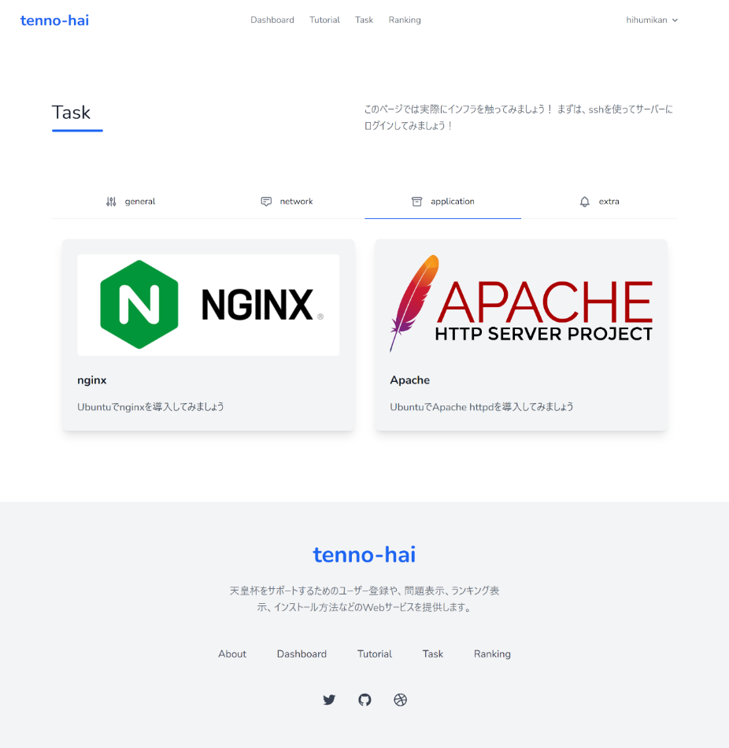

図8:問題一覧の画面

図9では、問題の内容を表示するページである。ここから、実際にユーザが問題に着手出来るように問題文が表示される仕組みである。クリアしたら下のボタンを押すことで、クリア判定となり、タスク一覧から消える。

また、タスク自体が難しい、変えたいと思ったユーザに対して、下に他のタスク候補を表示するようにしている。

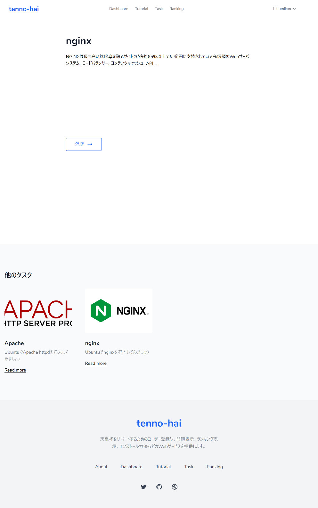

図9: 問題文の表示する画面

　

　図10では、ランキング表示をする画面である。ここで、他のユーザの進捗状況を確認することが出来る。

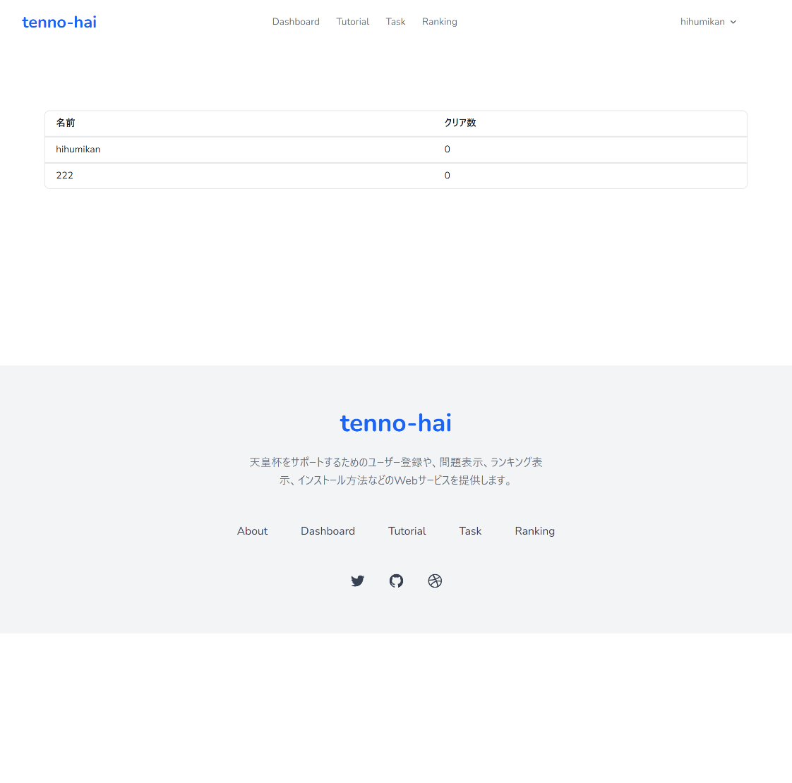

図10: ランキング表示する画面

　図11では、問題文を投稿できる画面である。ここから、問題を追加することが出来る。画像投稿機能を載せることによって、問題一覧で表示した際に、ユーザに分かりやすく問題がどういうものかを判断できるようにする。なお、これらは、運営者が投稿するものであり、ユーザには使用しないため、UI上にボタンを設けていない。

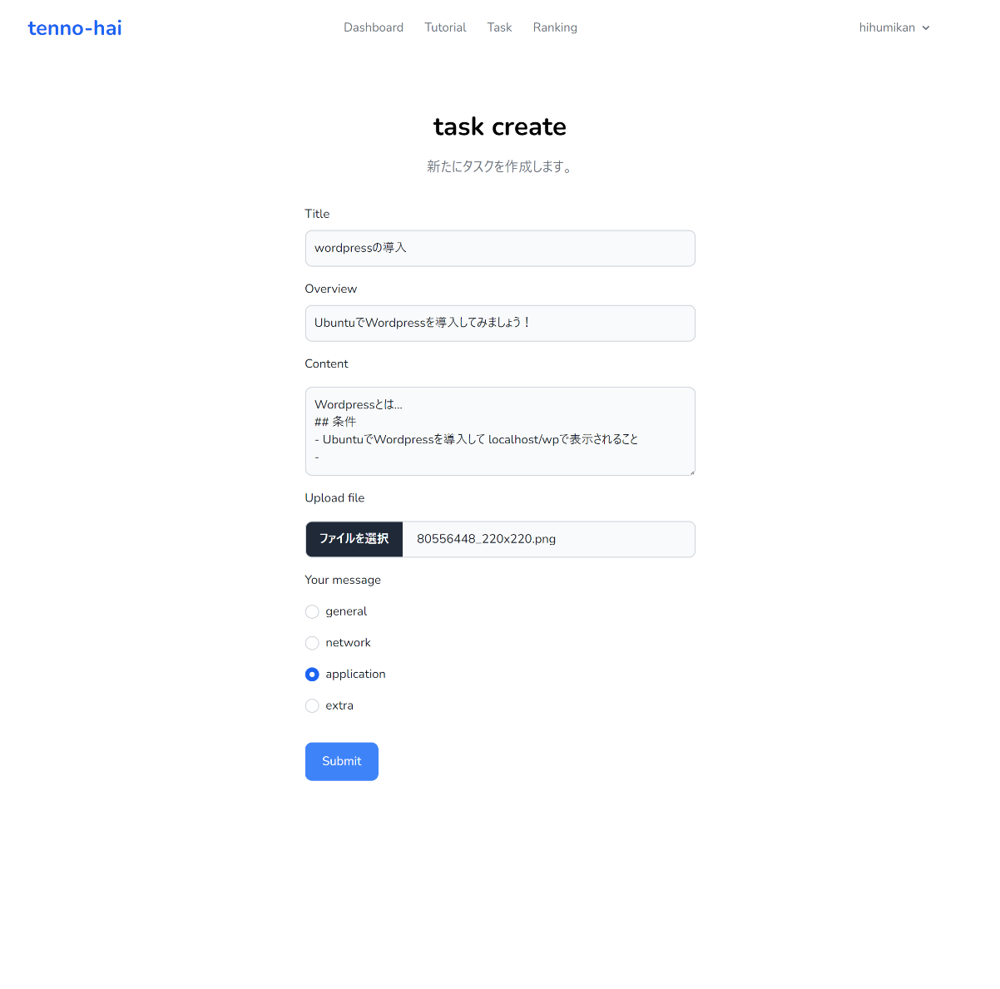

図11: 問題を作成する画面

　図12では、問題の訂正、削除を行うことが出来る。問題文に間違えがあった場合にこの機能を利用することで更新をすることが出来る。

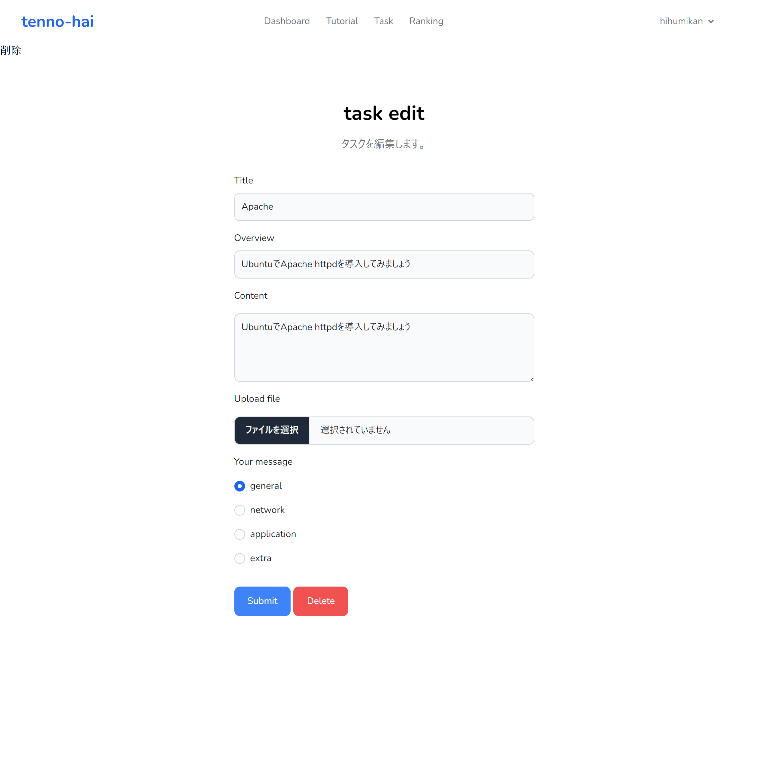

図12:問題の訂正、削除画面

**2.5 データベース設計**

　天皇杯フロントにて利用するデータベースを図13に示す。主要なテーブルはUsers、Issues、Results、Categoriesの4つを利用する。

　Usersでは、ユーザ情報を登録するテーブルになっている。名前とメール、パスワードを保管する。Issuesでは、問題を保管するテーブルになっており、タイトルと概要、画像、カテゴリーを保管する。Resultsでは問題の合否を保管するテーブルになっており、ユーザが登録することで、問題をクリアしたかどうかを判定する。Categoriesでは、問題のカテゴリーを分別するために用意してある。

　Groupsは今後、グループ機能として追加するのを見越して用意してある。他にも、従属キーなど適宜設定しており、正規形を意識した設計になっている。

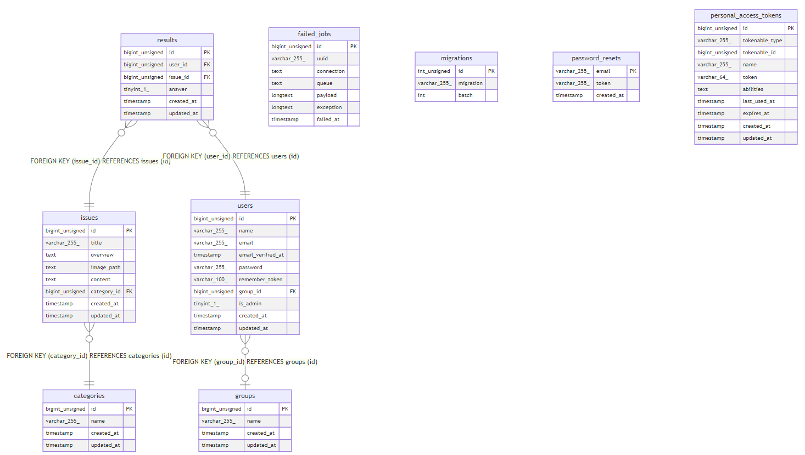

図13: データベース構成図

**2.6 URL設計**

URL設計では、図2に示してある画面遷移に伴ったルーティングを設定している。図14に示す。処理は殆どすべてControllerに移譲するように実装している。また、ユーザログインをしている人間のみ入れるページか否かを分別するようにしている。

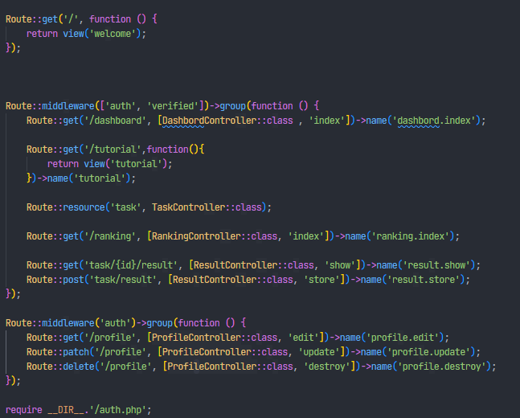

図14:ルーティング一覧

**2.7 開発環境設計**

　開発環境はGit/GitHubでバージョン管理を行っている。また、Git上ではGithubActionsによるコード自動整形やライセンス表記、プルリクエストテンプレートの用意、行動模範の明記など、OSSとして開発されるために用意している。

　また、Readme.mdには開発環境の始め方や基本的な記載を行っており、開発者が入りやすい設計をしている。Laravel Sailを導入しているので、Docker Composeのコマンド1つで環境が整う。

　

**3. 工夫点**

　本章では、工夫点について述べる。

**3.1 ディレクトリ構成**

　天皇杯フロントの制作において、前回の課題点であったディレクトリ構成が疎らである点を解消している。これによって、開発体験を良くすることに成功した。

**3.2 CSSによる見た目の向上**

　今回の制作では、実際に使われるサイトを意識して開発をしているため、CSSによるユーザビリティ向上にかなり力を入れた。初見にも分かりやすいUIデザインとは何かを紙でプロトタイピングをし、実際に画面上に起こすことが出来た。他のプロダクションに利用されているサイトと変わりないようなデザインに仕上げることが出来た。

**3.3 開発者体験の向上**

今回の制作では、OSSとして開発されるためのドキュメント整備やCI/CDの構築、Docker Composeによるクロス環境の差異を無くすことが出来た。それによって、新規OSS開発者でも参入できるような状態に仕上げた。

　また、TailwindCSS(flowbite)の導入によって、別途CSSファイルを必要としないため、viewファイル一つで見ればいいようにしている。

**4. 反省点,振り返り**

　本章では、振り返りと反省を行う。

**4.1 実装状況**

　実装については、設計通りの実装を行うことが出来た。

**4.2 反省点**

　今回の実装は予想以上にかなり時間を要するものとなってしまった。特に、デザインに凝り過ぎてしまったことによるものだと考える。次回は、デザインも含めた時間管理を行いたい。

**4.3 今後の展望**

　今後の展望としては、グループ機能追加や、クリア判定をシェルスクリプトによって自動的に送信して回答の合否を判定するシステムなどが考えられる。時間があり次第、開発を行いたい。

**5. おわりに**

本レポートではインフラを学びたい人向けのサービスである天皇杯フロントについての制作について取り上げ、サービスの設計と仕様、設計のコンセプトを述べたとともに、反省点などの振り返りを行った。
